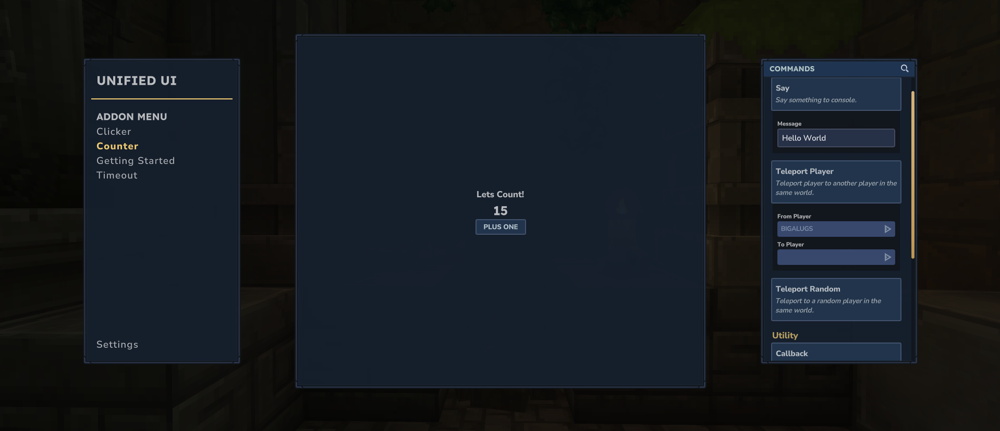

# Create Features

## Summary

Below are a handful of examples to get started with making custom features. For additional resources, review the following for type information and possible builder.with arguments.

- [Feature Definition](/hytale-unified-ui/scripting-reference/definitions/featureDefinition)
- [Feature Event Definition](/hytale-unified-ui/scripting-reference/definitions/featureEventDefinition)

:::info
It is safe to pass an empty string as a selector into the methods within `UICommandBuilder`. The builder provided is safely wrapped to ensure the entry point of the selector is nested within the UI hierarchy.
:::

## Counter Example

This is a basic example of how you can define a feature, using a `.ui` File or `appendInline()` method.

This demonstrates defining the UI with `UICommandBuilder`, handling the dynamic display of a counter value, and responding to the button click event.

Take note of how `playerCounter` is declared. The instance of ExampleFeature lives on the server, but when `getFeatures()` is called, you have access to the `playerRef` and can narrow down to the current player that the content is being rendered for. This is just an example, but in a real-world situation you would access a static instance, or pass a provider service to the constructor of `ExampleFeature` to supply outside data.

<div class="image-card">
	
</div>

```Java {15-16,23-24}
public class ExampleFeature implements UuiExtension {
	private final Map<UUID, Integer> playerCounter = new HashMap<>();

	@Override
	public CompletableFuture<List<FeatureDefinition>> getFeatures(PlayerRef playerRef) {
		// Initialize the Builder
		var featureBuilder = new FeatureDefinition.Builder(
			"counter",	// Feature ID
			"Counter"	// Display Name
		);

		// OPTION A: Build the interface using inline method.
		featureBuilder.withBuildUserInterface((builder) -> CompletableFuture.supplyAsync(() -> {
			int currentCount = playerCounter.getOrDefault(playerRef.getUuid(), 0);
			var filePath = "Example/Counter.ui";
			builder.append("", filePath);
			builder.set("#CountValue.Text", String.valueOf(currentCount));
			return null;
		}));

		// OPTION B: Build the interface using file method.
		featureBuilder.withBuildUserInterface((builder) -> CompletableFuture.supplyAsync(() -> {
			int currentCount = playerCounter.getOrDefault(playerRef.getUuid(), 0);
			var doc = """
				Group #RootElement {
					Anchor: (Full: 0);
					FlexWeight: 1;
					LayoutMode: MiddleCenter;
					Label {
						Text: "Hello World!";
					}
					Label {
						Text: "%s";
					}
					TextButton #AddButton {
						Anchor: (Width: 100);
						Text: "Plus One";
					}
				}
				""";
			var docParsed = doc.stripIndent().replace("\t", "  ").formatted(currentCount);
			builder.appendInline("", doc);
			builder.set(
				"#RootElement.Background",
				Value.ref("UnifiedUI/Shared/Container.ui", "ContainerSimpleBackground")
			);
			return null;
		}));

		// Add event for the button click.
		featureBuilder.withGetEventDefinitions(() -> CompletableFuture.supplyAsync(() ->
			Collections.singletonList(
				new FeatureEventDefinition(
					"#AddButton",
					"increment",
					CustomUIEventBindingType.Activating,
					Collections.emptyMap(),
					Collections.emptyMap()
				)
			)
		));

		// Handle click event and increment counter.
		featureBuilder.withHandleEvent((action, actionArgs, elementData) ->
			CompletableFuture.supplyAsync(() -> {
				if (!action.equals("increment")) {
					return false;
				}
				var currentCount = playerCounter.getOrDefault(playerRef.getUuid(), 0);
				playerCounter.put(playerRef.getUuid(), currentCount + 1);
				return true;
			})
		);

		// Build and return feature.
		var feature = featureBuilder.build();
		return CompletableFuture.completedFuture(List.of(feature));
	}

	@Override
	public CompletableFuture<List<CommandDefinition>> getCommands(PlayerRef playerRef) {
		return CompletableFuture.completedFuture(List.of());
	}

	@Override
	public CompletableFuture<Void> onPageClose() {
		playerCounter.clear();
		return CompletableFuture.completedFuture(null);
	}
}
```

```json title="Common/UI/Custom/Example/Counter.ui"
// NOTE: copy/pasting this directly could result in error due to tab space parsing in Hytale.

$Common = "../Common.ui";
$UuiContainer = "../UnifiedUI/Shared/Container.ui";
$UuiTypography = "../UnifiedUI/Shared/Typography.ui";

$UuiContainer.@ContainerSimple {
    #Content {
        LayoutMode: MiddleCenter;
        $UuiTypography.@LabelH3 {
            Text: "Lets Count!";
        }
        $UuiTypography.@LabelH1 #CountValue {
            Text: "";
        }
        $Common.@SmallSecondaryTextButton #AddButton {
            Text: "Plus One";
        }
    }
}
```
