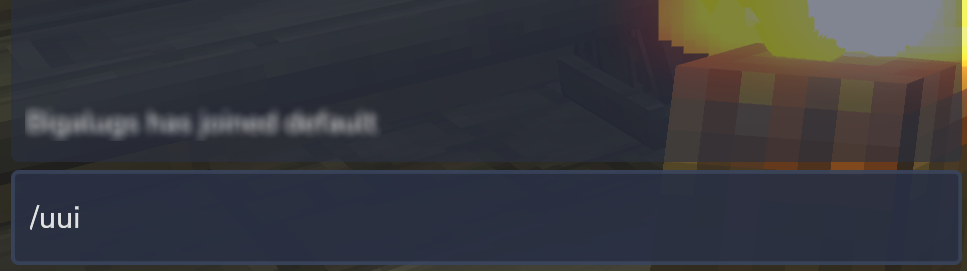

# Configuration

After [installing](installation) the **Unified UI**. You can use it immediately and start <a href="#customization-options">customizing</a> to you your liking.

## Display the UI

Displaying the UI is as easy as running `/uui` in the chat box.

	

## Permissions

To access admin features there are two permissions that can to be granted.

- `com.deezmods.unifiedui.admin-read`
- `com.deezmods.unifiedui.admin-write`

### Admin Read Access

Admin read access allows the user to view information via chat commands.

- List Extensions.
- List Extension Features.
- List Extension Commands.

See the `/help uui` command menu for more information.

### Admin Write Access

Admin write access grants all of `com.deezmods.unifiedui.admin-read` options.

This also adds additional options in the setting menu of **Unified UI**. Where you can make changes to how and what content is displayed for all users.

## Customization Options

:::info

- Options set under the user sections are relative to that user only, to affect all users then edit the admin sections.

:::

### Sorting Features

Users and Admins can set the ordering priority for items that show up in the Addon Menu.

The ordering priority is determined by:

- `1st` Player Preference
- `2nd` Admin Preference
- `3rd` Menu item name [a-z]

### Disabling Features and Commands

Users and Admins can disable Features and Commands.

The disabling priority is determined by:

- `1st` Admin Preference
- `2nd` Player Preference

When something is disabled under the admin section, it is no longer available to the user section.

### Command Favorites

Users are able to set command favorites only. Once configured, users will be able to toggle the command list display by pressing the star icon in the commands panel header.

:::warning[TODO]

This feature has not yet been fully implemented. Settings can be configured, but the UI needs to be integrated with this option.

:::

### Interface Title

This option is for admins only. You can change the default menu title text from 'Unified UI' to whatever you please; such as server name.

:::warning[TODO]

This feature has not yet been fully implemented. Settings can be configured, but the UI needs to be integrated with this option.

:::
