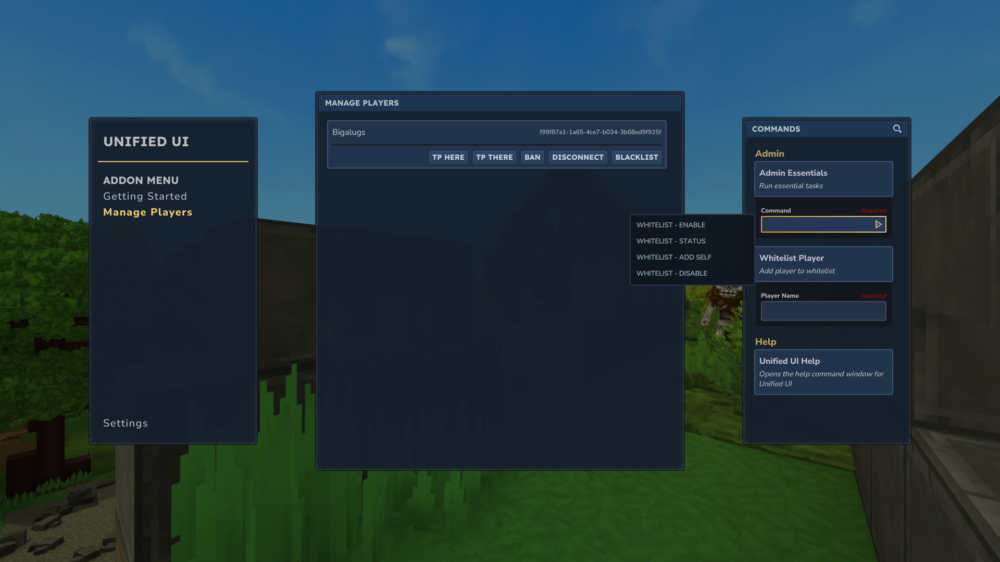

	

# **Summary**

Admin Essentials is an extension for the UnifiedUI plugin ecosystem. Allowing admins to easily manage players on your server.

# **Dependency**

This plugin has a dependency on the [UnifiedUI](https://www.curseforge.com/hytale/mods/unifiedui) and [UnifiedUI: API](https://www.curseforge.com/hytale/mods/unifiedui-api) plugin. If installing mods directly via Curseforge, then dependency installation is handled automatically.

# **Permissions**

`com.deezmods.unifiedui.extension.admin.essentials`

# **Commands**

Displaying the UI is as easy as running `/uui` in the chat box.

# **Features**

- Temporary Kick
- Whitelist and Banning
- Player Teleports \[Here / There\]

# **Roadmap**

- Additional player controls
- Manage server backups
- Plugin manager
